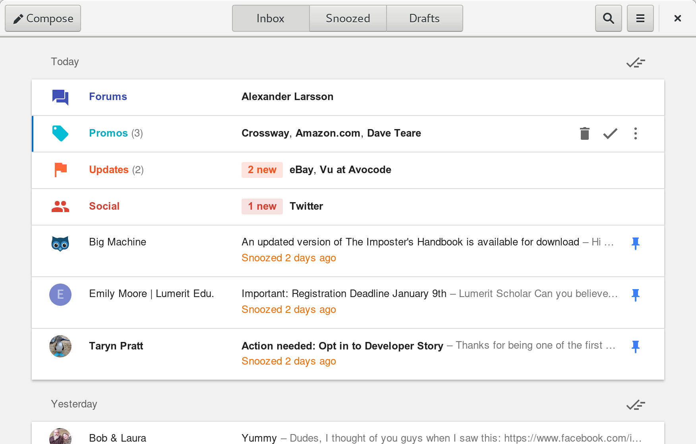

GNOME Inbox
===========

### Dependencies

 * [JSGtk+](https://github.com/WebReflection/jsgtk) (`jsgtk` from the AUR on Arch)
   * JSGtk+ depends on [GJS](https://wiki.gnome.org/Projects/Gjs) (`gjs` on Arch)
 * [GTK+ 3](https://www.gtk.org/) (`gtk3` on Arch)
 * [WebKitGTK+ 2](https://webkitgtk.org/) (`webkit2gtk` on Arch)

### Running

No compile step necessary, just run:

    jsgtk src/index.js

### Licensing

GNOME Inbox is free software; you can redistribute it and/or modify it under the terms of the GNU General Public License as published by the Free Software Foundation; either version 3 of the License, or (at your option) any later version.
